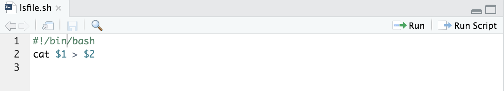

# Homework-1-Jialan8020
homework-1-Jialan8020 created by GitHub Classroom

*Screenshots of question #2.*

* a.png: make a directory named "Test"

* b.png: open the forked course repository

* c.png: add a readme.md file to the Test directory

* d.png: write descriptions in the readme.md file

* e.png: Edited the readme.md file with markdown syntax

*Screenshots of question #3*

* a.png: added readme.md file to the forked repository and asked for a pull request

* b.png: commits made in the forked repository (uploading and editing of readme.md file)

*Screenshots of question #4*

* a.png: created a new repository named "ds4bmeTest"

* b.png: the newly created repository

* c.png: added a readme.md file to the new repository

*Screenshots of question #5*

* a. png: Created a new webpage

* b. png: The new webpage

[My first webpage](https://jialan8020.github.io/ds4bmeTest/)

*Screenshots of question #6*

* a. png: When the bash file is executed in the form `./lsfile.sh path output`, the output from `path` will be output to `outfile`.

*Screenshots of question #7*

* a. png: The bash script that researches recursively for any files that contain ".dcm" and store the files to a new file. 

* b. png: Result of the search. In my case, the files were stored in the file named "storage" as shown by the screenshot.

*Screenshots of question #8*

* a.png: Count the number of lines in the wikipedia webpage Alexander the Great. The total number of lines is 3680.

